---
output:
  pdf_document:
    toc_depth: 3
    extra_dependencies: multicol
  #   toc_depth: '3'
  html_document:
    toc_depth: '3'
    df_print: paged
  # word_document:
theme: united
urlcolor: blue
linkcolor: black
---

\pagenumbering{gobble}
```{r, echo=FALSE, out.width="97%"}
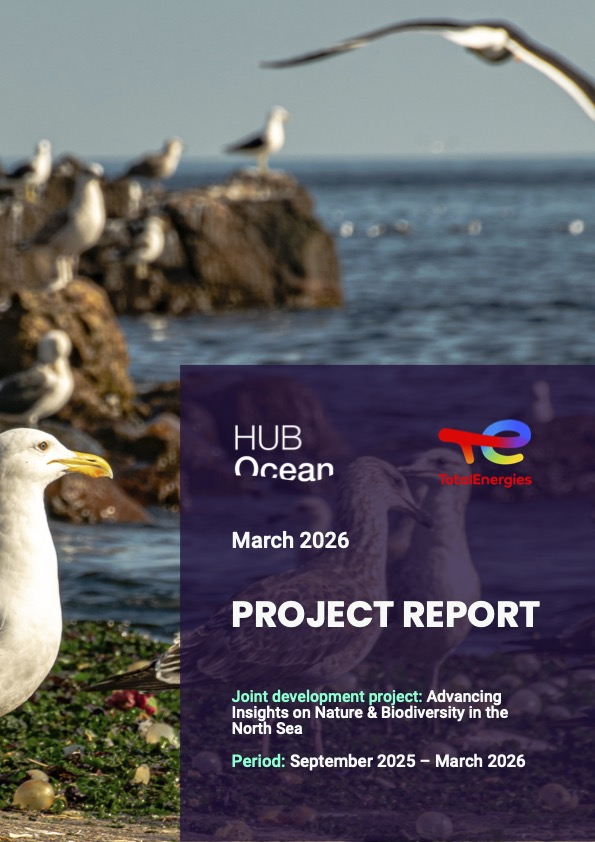
```

\tableofcontents

\newpage
\pagenumbering{arabic}

# ***Executive Summary***
## Partnership highlights
TotalEnergies seeks to extend its position in operating in the marine and coastal environments to share ocean data. The company understands that its industry and operations have impacts on the ecosystem where it operates. In an effort to improve upon the environmental impact assessments (EIAs) undertaken by the company before commencing on projects, the company desires to gain insights on a seascape beyond the areas identified for particular projects. To demonstrate this commitment, TotalEnergies shares its environmental data on its [North Sea Environmental Portal](https://www.northseaenvironmentportal.eu). With an ambition to further drive industry change and accelerate environmental data disclosures, TotalEnergies collaborated with HUB Ocean to assess if a composite index for the Greater North Sea on nature could get created.

The partnership aimed to provide context on the ecological and biological composition in the Greater North Sea so TotalEnergies's environmental risk assessments can better reflect real conditions. In motivation to gain these insights, HUB Ocean's team was originally tasked to answer 6 main questions:

1. What is required for the confidence score in HUB Ocean's analysis to serve as a reliable out-of the-box indicator of nature data in the context of TotalEnergies's risk assessments for EIAs?
2. How can the nature layers of the analysis meet TotalEnergies' need for non-survey based insights into biodiversity and habitats?
3. Can the “weighted nature presence” insights from the the analysis be a sufficient and trusted index for TotalEnergies to assess and quantify nature presence in areas of interest for EIAs?
4. How can the integration of high-resolution and up-to-date nature data layers improve the accuracy and effectiveness of TotalEnergies’ EIAs?
5. What is required to ensure that the data product is scientifically robust and practically applicable?
6. Can the project improve the value and utilization of TotalEnergies' North Sea Environmental Portal by integrating industry-shared data from the portal into the analysis data product?

## Analytical approach and proof of concept
To investigate TotalEnergies's risk assessment for EIAs, HUB Ocean partnered with TotalEnergies to create a layer that would summarise ocean sensitivity. An accurate characterization of the seascape relies on a broad range of ecological and biological indicators. This ocean sensitivity layer would integrate ecological and biological data that best reflect present conditions in the Greater North Sea in 500 meter hexagons. Producing high quality datasets for these indicators take years, so this study leveraged already existing data. To build the overall dataset, however, required data that had permissions for commercial use, which limited what could get used. Seven datasets built two submodels within the composite nature index.

The biological submodel integrated three different species biodiversity indicators. A fish species biodiversity summary product already existed for the North Sea. For cetaceans and seabirds biodiversity indicators, the study relied on species distribution models produced for a list of species given to and created by HUB Ocean. Not completely exhaustive, species distribution models for 13 cetacean species and 53 seabird species created the biodiversity indicators for the cetacean and seabird groups. These three biodiversity indicators provided equal influence on the summed submodel score. All of the layers had resolutions higher than the desired 500 meters. The fish dataset had a resolution of 0.25° (approximately 25 kilometers) due to two variables used in its model, while the cetaceans and seabirds had a higher resolution at 5 kilometers.

The other submodel, which received 55% of the total final model score, included four ecological and management data layers. Cold water corals and seagrass datasets provided key habitat indicators for the nature index, while management indicators were represented by important marine mammal areas and marine protected areas.

In adapting the analysis to the realities of data availability and quality, the study also altered the questions that it investigated. Beyond the nature index, the study analyzed species habitat classification (unlikely habitat, probable habitat, and core habitat) within two North Sea protected areas. The European Union designated particular protected areas under the European Union [Birds Directive](https://environment.ec.europa.eu/topics/nature-and-biodiversity/birds-directive_en) and [Habitat Directive](https://environment.ec.europa.eu/topics/nature-and-biodiversity/habitats-directive_en). Thus, the study examined the protected areas's species habitat classification for each of the species that receives protection within two protected areas identified by TotalEnergies: Doggerbank and Sydlige Nordsø.

## Conclusions
The analysis shifted priorities and produced results that marginally answered the originally proposed questions at the project's beginning. Due to data limitations and time constraints, the first question never got fully answered. A major data limitation involving the data centered on the licenses. Constructing a composite index that includes datasets that accurately reflect nature is challenging. More datasets were identified to improve the accuracy of reflecting existing nature. In a few instances, licenses did not permit their use for commercial application. More data would have provided the analysis an ability a better answer regarding the confidence of the nature index data product. The study can provide some insights on confidence regarding the modeled data and the final nature index. The modeled data report their uncertainties and correlation metrics. For instance, the modeled fish species richness had a high correlation with surveyed species richness. There exists confidence in the relative dynamic between high to low areas, even if the exact species richness is incorrect. Similarly, the study has confidence in the relative dynamics of the nature index, even if it cannot produce a confidence score on the final values.

Biodiversity and habitat surveys return the best insights of what exists where. This study demonstrated a pathway for TotalEnergies to build a composite nature index that does not rely on its own surveys. To improve the reduction of its impacts on habitats and species, TotalEnergies could combine its own biological surveys with other existing survey data to identify high natures areas. If it cannot undertake its own surveys and must rely on non-survey based methods, TotalEnergies should find metrics that meet a few features: easy to measure, large time coverage, varying geographic scope and resolution, and frequent measurement. TotalEnergies will have to determine how to assess missing data if it pursues non-survey based methods.

Model and submodel weighting add complexity to any model. Weighting, in an ideal world, would rely on a quantitative scoring or metrics. Unfortunately, as in the case of this study, the weighting is based on expert opinion. For the study, the management and ecological submodel received greater weight due to the more refined resolution for the datasets and higher level of confidence in the outputs. Administrative boundaries for protected areas and important marine mammal areas have strict legal definitions. Species richness based on species distribution models, though quantitatively produced, have greater uncertainty. For future analyses, TotalEnergies should make weighting decisions on an iterative process. Two methods for determining or assessing weights (equal weighting which is often viewed as no weighting is actually still weighting) are: correlation analysis and uncertainty/sensitivity analysis. Refining the weights for the datasets and submodels can make the nature index a more trusted data component for TotalEnergies.

The fourth question asked at the beginning of the partnership aimed to answer about the integration of high-resolution and up-to-date data related to the environmental impact assessments performed by TotalEnergies. This study has a challenging time in answering this given that the most of the datasets integrated were at lower resolution. Some of the most up-to-date data could not get used in the analysis due to the licenses not permitting commercial use. If that license were to change or other data become available, then the accuracy would increase.

Many of the aspects that address the first four questions can directly relate to the fifth question on the scientific robustness and practicality of the data products. As mentioned before, metrics that are easy to measure, frequently measured, and cover large areas at variable scales provide confidence in the data. The species data existed at resolutions that made the analysis scientifically less robust and less practical. Down-scaling the data from 25 and 5 kilometers to 500 meters increases the error, thus lowering the scientific robustness. Down-scaling, in this particular situation, would produce less of an issue as it would likely overestimate species richness. Overestimating species richness would make the analysis more conservative as those layers would gain greater weight in the final model and make those areas less desirable for development. A problem would occur if overestimating species richness has a direct impact on habitats. The biological submodel would gain slightly more weight than it would otherwise, thus lowering the habitats submodel areas. Real habitat areas could get impacted by possibly theoretical species.

When data come from another source, knowing the methods to produce the data will help determine how applicable they are for the analysis. The species distribution models for cetaceans and seabirds, for instance, used maximum entropy and ensemble models. Knowing the models used informed the analysis that the modeled outputs relied on presence-only data. Maxent (maximum entropy) and ensemble models do not use presence-absence data. Models integrate presence-absence data are scientifically robust method for creating species distribution models. They are less frequently used given absence data are rarely recorded. TotalEnergies biological surveys could not presence and absence to help improve the species distribution models for the areas it aims to develop. That would also help shape the final question. Integrating industry data could improve a composite nature index. This analysis could not answer that question as it did not integrate any industry-shared data for the North Sea Environmental portal nor any other industry data.

Nature index scores were generally higher closer to shore than offshore in the Greater North Sea. The higher nature scores often overlapped with the protected areas. Within the Greater North Sea, the eastern and southern portions have higher values than the central and northern areas.

```{r, echo = FALSE, fig.align = "center", out.width = "8in", out.height = "9in", fig.cap = "HUB Ocean composite nature index final scores across the Greater North Sea"}
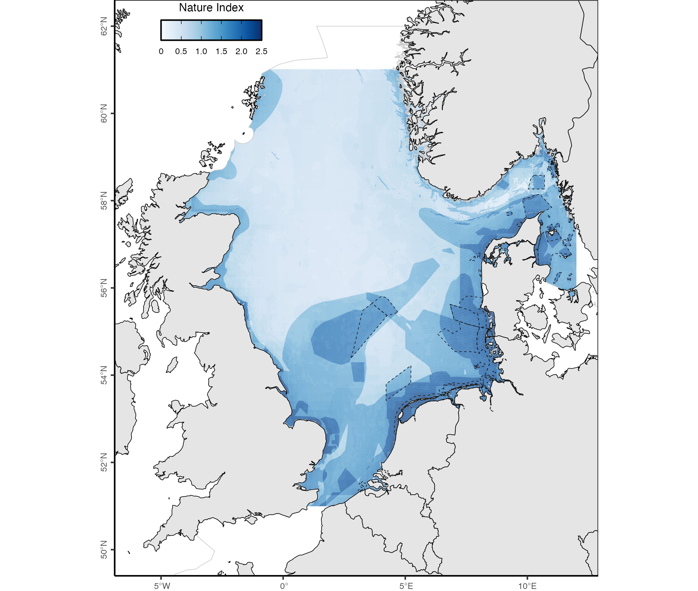
```

```{r, echo = FALSE, fig.align = "left", out.width = "6in", out.height = "6in", fig.cap = "HUB Ocean composite nature index final scores in and around the Doggerbank special conservation interest"}
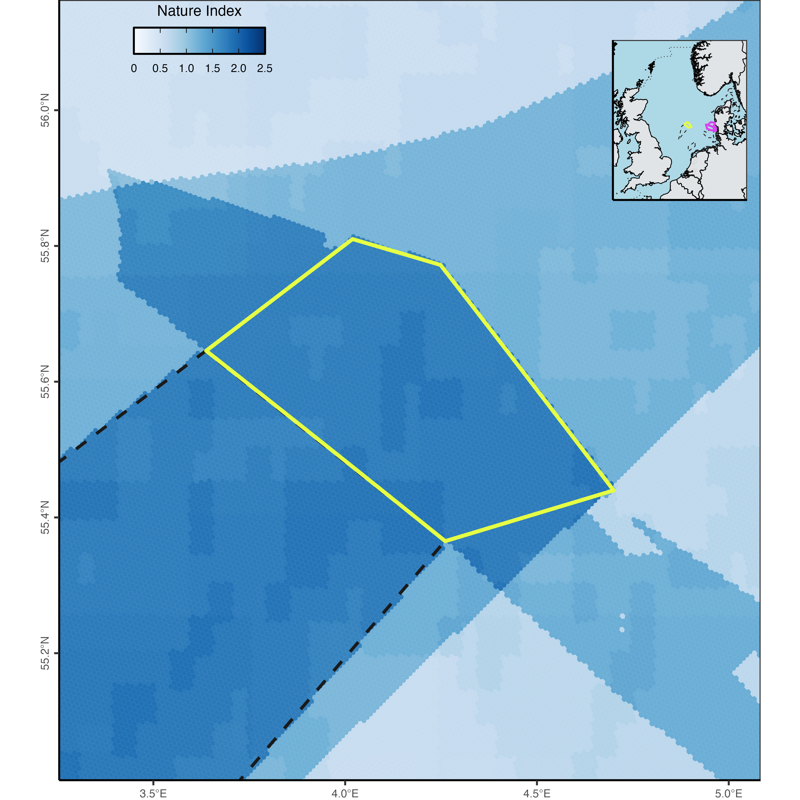
```

```{r, echo = FALSE, fig.align = "left", out.width = "6in", out.height = "6in", fig.cap = "HUB Ocean composite nature index final scores in and around the Sydlige Nordsø special conservation intest and Sydlige Nordsø special protection areas"}
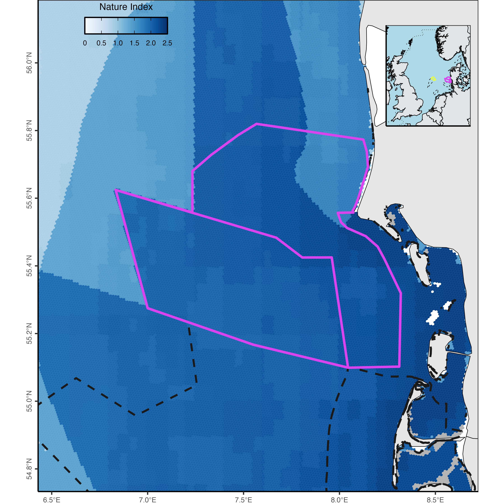
```

\newpage
# Advancing nature and biodiversity insights in the North Sea
Habitat sensitivity assessment in North Sea

**Points of contact**

* **Analysis:** [Brian Free](mailto:brian.free@oceandata.earth)
* **Ocean Data Platform:** [Max Romagnoli](mailto:max.romagnoli@oceandata.earth)
* **Project lead:** [Laurence Janssens](mailto:laurence.janssens@oceandata.earth)

* **TotalEnergies adviser:** [Phil Wemyss](mailto:phil.wemyss@external.totalenergies.com)
* **TotalEnergies GIS analyst:** [Katrina Povidisa-Delefosse](mailto:katrina.povidisa-delefosse@totalenergies.com)
* **TotalEnergies GIS analyst:** [Ilaria Valentini](mailto:ilaria.valentini@totalenergies.com)

### Repository Structure
-   **data**
    -   **raw_data:** the raw data integrated in the analysis (**Note:** original data name and structure were kept except when either name was not descriptive or similar data were put in same directory to simplify input directories)
    -   **intermediate_data:** disaggregated processed data
    -   **hex_data:** geopackage 

***Note for PC users:*** The code was written on a Mac so to run the scripts replace "/" in the pathnames for directories with two "\\".

Please contact Brian Free ([brian.free@oceandata.earth](mailto:brian.free@oceandata.earth)) with any questions regarding the code.

## **Overview**
### Scope
A partnership between TotalEnergies and HUB Ocean sought to highlight insights on the ecological and biological composition in the Greater North Sea to help TotalEnergies's better reflect real conditions in its environmental risk assessments. TotalEnergies tasked HUB Ocean's team to answer 6 questions:

1. What is required for the confidence score in HUB Ocean's analysis to serve as a reliable out-of the-box indicator of nature data in the context of TotalEnergies's risk assessments for EIAs?
2. How can the nature layers of the analysis meet TotalEnergies' need for non-survey based insights into biodiversity and habitats?
3. Can the “weighted nature presence” insights from the the analysis be a sufficient and trusted index for TotalEnergies to assess and quantify nature presence in areas of interest for EIAs?
4. How can the integration of high-resolution and up-to-date nature data layers improve the accuracy and effectiveness of TotalEnergies’ EIAs?
5. What is required to ensure that the data product is scientifically robust and practically applicable?
6. Can the project improve the value and utilization of TotalEnergies' North Sea Environmental Portal by integrating industry-shared data from the portal into the analysis data product?

To investigate TotalEnergies's risk assessment for EIAs, HUB Ocean summarised ecological and biological data from publicly available datasets to create a composite index. This study leveraged already existing data as producing high quality datasets for these indicators take years. No limit existed on the number of datasets, but the data needed to provide ecological and biological metrics for the Greater North Sea that best reflect present conditions. To build the overall dataset, however, required data that had permissions for commercial use, which limited what could get used. Seven datasets built two submodels within the composite nature index.

The biological submodel integrated three different species biodiversity indicators: fish species diversity, cetacean species diversity, and seabird species diversity. The other submodel, which received 55% of the total final model score, included four ecological and management data layers. Cold water corals and seagrass datasets provided key habitat indicators for the nature index, while management indicators were represented by important marine mammal areas and marine protected areas.

The analysis adapted its scope to the realities of data availability and quality. It did not answer many of the questions and investigated slightly different ones. Beyond creating a composite nature index, the study examined species habitat classification (unlikely habitat, probable habitat, and core habitat) within two North Sea protected areas for the species those protected areas had directives to protect. The European Union designated particular protected areas under the European Union [Birds Directive](https://environment.ec.europa.eu/topics/nature-and-biodiversity/birds-directive_en) and [Habitat Directive](https://environment.ec.europa.eu/topics/nature-and-biodiversity/habitats-directive_en). TotalEnergies identified two protected areas identified for the investigation: Doggerbank and Sydlige Nordsø. 

### Study region
The study defined a boundary box for the Greater North Sea with points of:

* southwest: -4.4454, 50.9954
* northwest: -4.4454 61.0170
* northeast: 12.0059, 61.0170
* southeast: 12.0059, 50.9954

Since the desired resolution for the analysis was at 500m, a hex grid at [resolution 8](https://h3geo.org/docs/core-library/restable) generated the hex grid using [H3 indexes](https://h3geo.org) within 
the [Greater North Sea](https://www.marineregions.org/gazetteer.php?p=details&id=36317). [Marine Regions](https://marineregions.org/gazetteer.php) provided the boundary layer of the Greater 
North Sea (as defined by [ICES](http://gis.ices.dk/geonetwork/srv/eng/catalog.search#/metadata/4745e824-a612-4a1f-bc56-b540772166eb)) in the final analysis.

## **Data sources**
### Generic data
| Layer | Data Source | Data Name | Metadata  | Notes |
|---------------|---------------|---------------|---------------|---------------|
| Study area | [mregions2](https://docs.ropensci.org/mregions2/) | [Marine Regions](https://marineregions.org/gazetteer.php) | [Greater North Sea](https://www.marineregions.org/gazetteer.php?p=details&id=36317) | Defined by [ICES Ecoregions](http://gis.ices.dk/geonetwork/srv/eng/catalog.search#/metadata/4745e824-a612-4a1f-bc56-b540772166eb) |
| Platforms | TotalEnergies | | | |
| Species list | [Natura 2000](https://natura2000.eea.europa.eu) | [Doggerbank](https://biodiversity.europa.eu/sites/natura2000/DE1003301) | | 1 habitat, 7 species |
| Species list | [Natura 2000](https://natura2000.eea.europa.eu) | [Sydlige Nordsø](https://biodiversity.europa.eu/sites/natura2000/DK00VD374) | | 0 habitats, 0 species |
| Species list | [Natura 2000](https://natura2000.eea.europa.eu) | [Sydlige Nordsø](https://biodiversity.europa.eu/sites/natura2000/DK00VD375) | | 1 habitat, 3 species |
| Species list | [Natura 2000](https://natura2000.eea.europa.eu) | [Jyske Rev, Lillefiskerbanke](https://biodiversity.europa.eu/sites/natura2000/DK00VA257) | | 1 habitat, 0 species |
| Species list | [Natura 2000](https://natura2000.eea.europa.eu) | [Sandbanker ud for Thyborøn](https://biodiversity.europa.eu/sites/natura2000/DK00VA340) | | 2 habitats, 1 species |
| Species list | [Natura 2000](https://natura2000.eea.europa.eu) | [Sylter Aussenriff](https://biodiversity.europa.eu/sites/natura2000/DE1209301) | | 2 habitat, 17 species |

### Nature data
| Layer | Data Source | Data Name | Metadata  | Notes |
|---------------|---------------|---------------|---------------|---------------|
| Fish | [Cesc Gordó-Vilaseca](https://www.nature.com/articles/s41467-024-49911-9) | Fish species richness | [GitHub repository](https://github.com/CescGV/JSDM-Barents-Norwegian-North/tree/main) |
| Cetaceans | [MPA EU](https://mpa-europe.eu) and provided by Silas C. Principe | Cetaceans species distribution models | | [GitHub](https://github.com/iobis/mpaeu_sdm/tree/main), [Shiny OBIS](https://shiny.obis.org/distmaps/) |
| Seabirds | [MPA EU](https://mpa-europe.eu) and provided by Silas C. Principe | Seabirds species distribution models | | [GitHub](https://github.com/iobis/mpaeu_sdm/tree/main), [Shiny OBIS](https://shiny.obis.org/distmaps/) |
| Conservation areas | [Marine Mammals Protected Areas Task Force](https://www.marinemammalhabitat.org) | Important Marine Mammal Areas | | Need to [request download](https://www.marinemammalhabitat.org/immas/imma-spatial-layer-download/) |
| Protected areas | [Protected Seas](https://protectedseas.net) | Marine protected areas | [Ocean Data Platform](https://app.hubocean.earth/catalog/dataset/a608f54b-75c7-4df9-a3a8-cedbfa391873/protectedseas-navigator-v2-focused-area-based-protections) | Used the focused dataset |
| Corals | [Tong et al. (2023)](https://www.frontiersin.org/journals/marine-science/articles/10.3389/fmars.2023.1217851/full) | Cold water corals | | [Direct data download](https://zenodo.org/records/7896310) |
| Seagrass | [WCMC](https://data-gis.unep-wcmc.org/portal/home/item.html?id=aaa46cd3d3d640b2916b8f0a0ffe07cb) | Seagrass | [ISO](https://data-gis.unep-wcmc.org/portal/sharing/rest/content/items/aaa46cd3d3d640b2916b8f0a0ffe07cb/info/metadata/metadata.xml?format=default&output=html) | [Ocean Data Platform](https://app.hubocean.earth/catalog/dataset/7199f9bc-96ae-49d1-a814-df8c4bcc7552/unep-wcmc-global-distribution-of-seagrasses-polygons), [WCMC direct data download](https://wcmc.io/WCMC_013_014) |

## **Methods**
### Geographic constraint
Each nature dataset got limited to the [Greater North Sea](https://www.marineregions.org/gazetteer.php?p=details&id=36317) boundary before performing any further data transformations.

### Linear normalization
A linear function normalized species richness values for fish, cetaceans, and seabirds. Normalizing the minimum and maximum species richness to be between 0 and 1 allowed these data to get compared to the datasets that receive
a discrete value for presence and absence (1 or 0).

The linear normalized function is: $$[1]\ (value - minimum)\ /\ (maximum - minimum) = normalized\_score$$

To avoid returning a zero for the normalized score (when the value is equal to the minimum), when the linear function returns 0.00, then a value of 0.01 got added. By adding value to the minimum value, it ensures that any species richness never would get treated as absence.

### Overlapping features
When a hex grid received more than one value from a linear normalization, due to the shape incongruity, then the maximum value was kept. Selecting the maximum value ensured the study pursued an approach that reflected a precautionary principle (read [here](https://www.ospar.org/convention/principles/precautionary-principle) for further context on the principle) since the nature index wouldrepresent the best case scenario for nature.

### Habitats
_Cold water corals_

The cold water corals dataset contained values that range between 0 and 1000 for 10 species. Suitability classifications on coral presence are separated by steps of 200: very low (<200),
low (200 - 400), moderate (400 - 600), high (600 - 800), and very high (800). This study only considered if a cold water coral was present, not the overall species richness. To determine
if a cold water coral reef was present, the maximum score across the 10 species was returned and only values above 600 were kept.

### Species
_Cetaceans_

Cetaceans considered in the analysis either had at least one observation in the [Joint Cetacean Database Programme](https://cetaceans.ices.dk/beta/Inventory?selecteddataset=JCDP&selecteddataset=ESAS) (for more information
about the [JCDP](https://jncc.gov.uk/our-work/joint-cetacean-data-programme) and [ICES statistical surveys](https://www.ices.dk/data/data-portals/Pages/Cetaceans.aspx)) or included in the [Waggitt et al. (2020)](https://besjournals.onlinelibrary.wiley.com/doi/full/10.1111/1365-2664.13525).
The only species from Waggitt et al. (2020) that did not have at least one observation in the ICES statistical survey was _Physeter macrocephalus_.

These species included:

\begin{multicols}{2}
\begin{itemize}
\item \textit{Balaenoptera acutorostrata}
\item \textit{Balaenoptera physalus}
\item \textit{Delphinus delphis}
\item \textit{Grampus griseus}
\item \textit{Halichoerus grypus}
\item \textit{Lagenorhynchus acutus}
\item \textit{Lagenorhynchus albirostris}
\item \textit{Orcinus orca}
\item \textit{Phoca vitulina}
\item \textit{Phocoena phocoena}
\item \textit{Physeter macrocephalus}
\item \textit{Stenella coeruleoalba}
\item \textit{Tursiops truncatus}
\end{itemize}
\end{multicols}

_Seabirds_

Species compiled for seabirds came from Waggitt et al. (2020), ICES's [European Seasbirds at Seas](https://esas.ices.dk/inventory), and a list provided by TotalEnergies. Species from
the top 50 in ICES's ESAS supplemented the species already included in Waggitt et al. (2020) and the list provided by Total. The species included in the the lists are:

\begin{multicols}{2}
\begin{itemize}
\item \textit{Alca torda}
\item \textit{Alle alle}
\item \textit{Aythya marila}
\item \textit{Bucephala clangula}
\item \textit{Cepphus grylle}
\item \textit{Chlidonias niger}
\item \textit{Clangula hyemalis}
\item \textit{Fratercula arctica}
\item \textit{Fulmarus glacialis}
\item \textit{Gavia adamsii}
\item \textit{Gavia arctica}
\item \textit{Gavia immer}
\item \textit{Gavia stellata}
\item \textit{Gelochelidon nilotica}
\item \textit{Hydrobates leucorhous}
\item \textit{Hydrobates pelagicus}
\item \textit{Hydrocoloeus minutus}
\item \textit{Hydroprogne caspia}
\item \textit{Larus argentatus}
\item \textit{Larus canus}
\item \textit{Larus fuscus}
\item \textit{Larus glaucoides}
\item \textit{Larus hyperboreus}
\item \textit{Larus marinus}
\item \textit{Larus melanocephalus}
\item \textit{Larus michahellis}
\item \textit{Larus ridibundus}
\item \textit{Melanitta fusca}
\item \textit{Melanitta nigra}
\item \textit{Mergus merganser}
\item \textit{Mergus serrator}
\item \textit{Morus bassanus}
\item \textit{Phalacrocorax aristotelis}
\item \textit{Phalacrocorax carbo}
\item \textit{Phalaropus fulicarius}
\item \textit{Phalaropus lobatus}
\item \textit{Podiceps auritus}
\item \textit{Podiceps cristatus}
\item \textit{Podiceps grisegena}
\item \textit{Podiceps nigricollis}
\item \textit{Puffinus puffinus}
\item \textit{Rissa tridactyla}
\item \textit{Somateria mollissima}
\item \textit{Somateria spectabilis}
\item \textit{Stercorarius longicaudus}
\item \textit{Stercorarius parasiticus}
\item \textit{Stercorarius pomarinus}
\item \textit{Stercorarius skua}
\item \textit{Sterna hirundo}
\item \textit{Sterna paradisaea}
\item \textit{Sternula albifrons}
\item \textit{Thalasseus sandvicensis}
\item \textit{Uria aalge}
\item \textit{Xema sabini}
\end{itemize}
\end{multicols}

_Species distribution models_

Species distribution models for the interested species came from the [MPA Europe](https://shiny.obis.org/distmaps/) project on modeling ocean biodiversity. The study used species
distribution model data from MPA Europe given they were produced at 5km resolution; comparatively, Waggitt et al. (2020) modeled their species at 10km. To maintain comparability
between species, only species with modeled data by MPA Europe got included. Species were matched by their WoRMS [Aphia identification](https://www.marinespecies.org/about.php#what_is_aphia).
A marine mammal and two seabird species had different accepted species names in [WoRMS](https://www.marinespecies.org/index.php) than those used by ICES, Waggitt et al. (2020), and Total
Energies. The three species were:

- _Lagenorhynchus acutus_ [(137100)](https://www.marinespecies.org/aphia.php?p=taxdetails&id=137100) -- accepted name is _Leucopleurus acutus_ [(1571853)](https://www.marinespecies.org/aphia.php?p=taxdetails&id=1571853)
- _Larus melanocephalus_ [(137147)](https://www.marinespecies.org/aphia.php?p=taxdetails&id=137147) -- accepted name is _Ichthyaetus melanocephalus_ [(1584284)](https://www.marinespecies.org/aphia.php?p=taxdetails&id=1584284)
- _Thalasseus sandvicensis_ [(413044)](https://www.marinespecies.org/aphia.php?p=taxdetails&id=413044) -- accepted name is _Sterna sandvicensis_ [(137166)](https://www.marinespecies.org/aphia.php?p=taxdetails&id=137166)

MPA Europe did not posses a species distribution model for a species on the TotalEnergies list (_Hydrobates leucorhous_). The study thus did not include _Hydrobates leucorhous_ in the final analysis.

_Habitat designation_

MPA Europe's species distribution models relied on presence-only data. These species distribution models had a resolution at 5 kilometers. The [best modeled outputs](https://iobis.github.io/mpaeu_docs/methods-testing.html#overview-and-chosen-approach) were LASSO and maxent (maximum entropy). LASSO results were not available for download, so the priority were maxent along with ensemble outputs when the maxent models did not exist for a particular species.  Most species have the maxent models, but five had ensemble
models:

Cetaceans

- _Phoca vitulina_ [(137084)](https://www.marinespecies.org/aphia.php?p=taxdetails&id=137084)
- _Orcinus orca_ [(137102)](https://www.marinespecies.org/aphia.php?p=taxdetails&id=137102)
- _Tursiops truncatus_ [(137111)](https://www.marinespecies.org/aphia.php?p=taxdetails&id=137111)

Seabirds

- _Alle alle_ [(137129)](https://www.marinespecies.org/aphia.php?p=taxdetails&id=137129)
- _Rissa tridactyla_ [(137156)](https://www.marinespecies.org/aphia.php?p=taxdetails&id=137156)

Species distribution model (SDM) results were scored to reflect the match to likely habitat. Any location with a species distribution model value under 50 (quantitatively more probable than not)
was classified as unlikely habitat and given a score 0.3. Species distribution model values between 51 and 75 got a score of 0.6 to reflect that these areas are probable habitat. Core habitat
occurred in locations with values over 75 and they received a value of 1.

| SDM value | Classification | Score |
|---------------|---------------|---------------|
| 0 - 50 | Unlikely habitat | 0.3 |
| 51 - 75 | Probable habitat | 0.6 |
| 75+ | Core habitat | 1.0 |

A summarized total species richness layer was created for each cetaceans and seabirds by combining all species values for each. The linear normalization was run on the summarized data products and any instance where multiple values existed for the same hex, the maximum normalized value was selected.

_Fishes_

A summarized fish species data layer came from a paper by [Gordó-Vilaseca et al. (2024)](https://www.nature.com/articles/s41467-024-49911-9) that examined biomass distributions for a
variety of species across the North Sea and Barents Sea. The data shared by Gordó-Vilaseca are the present day species richness data (as seen in the paper's Figure 2(A)). The Greater North Sea boundary limited the data to the study region before applying a linear normalization and rescaling the minimum species richness. The fish dataset had a resolution of 0.25° (approximately 25 kilometers) due to two variables used in its model.

### Scores
| Layer | Score | Consideration |
|---------------|---------------|---------------|
| Fish | 0 - 1 | Linear normalization with 0.01 added to minimum |
| Cetaceans | 0 - 1 | Species list compiled from list provided by TotalEnergies, [Waggitt et al. (2020)](https://besjournals.onlinelibrary.wiley.com/doi/pdf/10.1111/1365-2664.13525), along  with cetaceans that have at least one observation in the [ICES statistical surveys](https://cetaceans.ices.dk/inventory) for the North Sea |
| Seabirds | 0 - 1 | Species list compiled from list provided by TotalEnergies, [Waggitt et al. (2020)](https://besjournals.onlinelibrary.wiley.com/doi/pdf/10.1111/1365-2664.13525), along  with data from [European Seabirds at Seas](https://esas.ices.dk/inventory) and [MPA EU](https://shiny.obis.org/distmaps/) |
| Protected areas | 0, 1 | Absence, Presence |
| Cold water corals | 0, 1 | Absence, Presence |
| Important Marine Mammal Areas | 0, 1 | Absence, Presence |
| Seagrass | 0, 1 | Absence, Presence |

### Submodel
Two submodels comprised the final nature score index. The fish, cetacean, and seabird data products were summarized in the mobile species submodel. The sessile submodel comprised of the other four datasets: protected areas, important marine mammal areas, cold water corals, and seagrass. Any "NA" data for a dataset got reclassified as a 0 before calculating submodel scores. These two submodels then were combined to produce a final nature score. More weight was allotted to the sessile submodel since at least two of the layers are immovable, making them more reliably known. The analysis weighted the sessile submodel with 55% of the score. It did not receive greater share of weight as the seagrass and coral reef datasets remain to have a level of uncertainty concerning their verified locations.

Below are the three main equations for calculating submodel and final model scores:

$$[2]\ mobile\_submodel\_score = fish\_value + cetacean\_value + seabird\_value$$
$$[3]\ sessile\_submodel\_score = protected\_area\_value + imma\_value + cold\_water\_coral\_value + seagrass\_value$$
$$[4]\ final\_model\_score = mobile\_submodel\_score * 0.45 + sessile\_submodel\_score * 0.55$$

## **Results**
Nature index scores were generally higher closer to shore than offshore in the Greater North Sea. The higher nature scores often overlapped with the protected areas. A major explanation for this is that protected areas were a factor in the final score, so those areas would already have a greater score than the surrounding areas. Within the Greater North Sea, the eastern and southern portions have higher values than the central and northern areas. Protected areas again contribute to this, but does not contribute completely. Fish species richness explains some of the trend since richness is higher at the lower latitudes than the central and northern latitudes.

Within the biological submodel, no minimum values existed for cetaceans and seabird species. Any minimum value must overlap with an area with a higher value that supercedes the minimum.

Table 1: HUB Ocean created composite nature index summary statistics across Greater North Sea
```{r, echo=FALSE, out.width="100%"}
# temp.df = data.frame(image="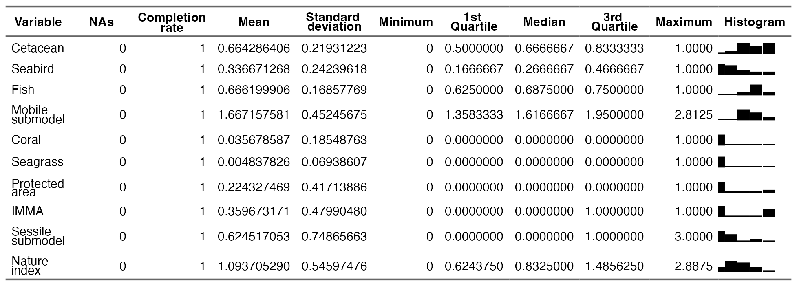")
# temp.mat <- as.matrix(temp.df)
# colnames(temp.mat) <- NULL
# knitr::kable(temp.mat, caption="Nature index summary statistics across Greater North Sea")

```

```{r, echo=FALSE, out.width="100%", fig.cap = "Data score histograms comprising HUB Ocean created composite nature index in Greater North Sea"}
# temp.df = data.frame(image="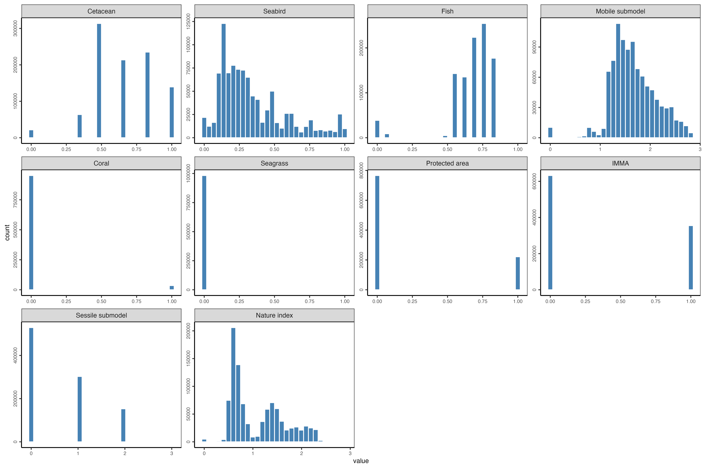")
# temp.mat <- as.matrix(temp.df)
# colnames(temp.mat) <- NULL
# knitr::kable(temp.mat, caption="Data score histograms comprising nature index in Greater North Sea")


```

Table 2: Cetacean normalized HUB Ocean created composite nature index score counts and percentage across the Greater North Sea
```{r, echo=FALSE, out.width="70%"}
# temp.df = data.frame(image="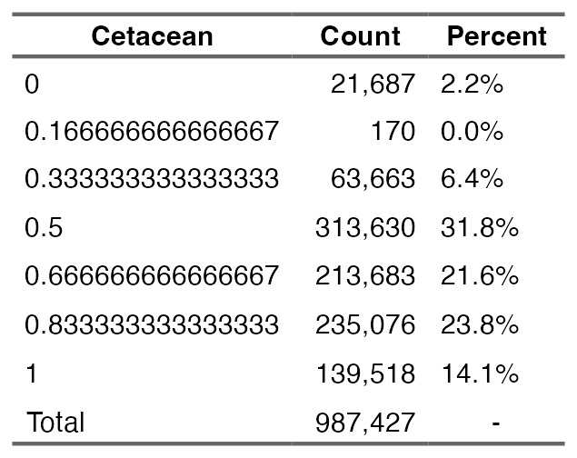")
# temp.mat <- as.matrix(temp.df)
# colnames(temp.mat) <- NULL
# knitr::kable(temp.mat, caption="Cetacean normalized score counts and percentage across the Greater North Sea")


```

\newpage
Table 3: Seabird normalized HUB Ocean created composite nature index score counts and percentage across the Greater North Sea
```{r, echo=FALSE, out.width="40%"}
# temp.df = data.frame(image="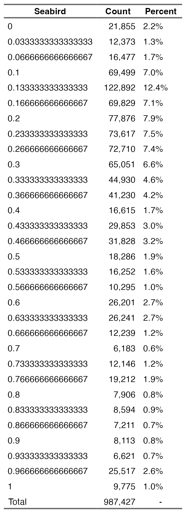")
# temp.mat <- as.matrix(temp.df)
# colnames(temp.mat) <- NULL
# knitr::kable(temp.mat, caption="Seabird normalized score counts and percentage across the Greater North Sea")


```

\newpage
Table 4: Fish normalized HUB Ocean created composite nature index score counts and percentage across the Greater North Sea
```{r, echo=FALSE, out.width="50%"}
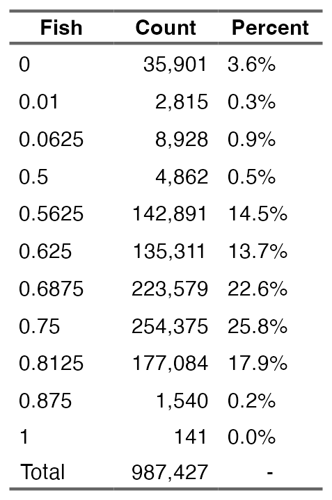
```

Table 5: Cold-water coral normalized score counts and percentage across the Greater North Sea
```{r, echo=FALSE, out.width="50%"}
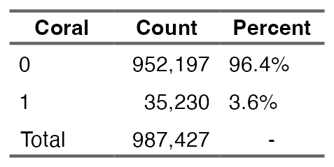
```

\newpage
Table 6: Seagrass normalized HUB Ocean created composite nature index score counts and percentage across the Greater North Sea
```{r, echo=FALSE, out.width="50%"}
# temp.df = data.frame(image="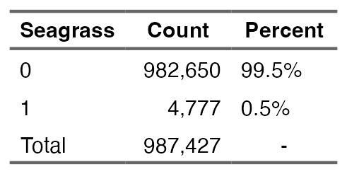")
# temp.mat <- as.matrix(temp.df)
# colnames(temp.mat) <- NULL
# knitr::kable(temp.mat, caption="Seagrass normalized score counts and percentage across the Greater North Sea")


```

Table 7: Important marine mammal areas normalized HUB Ocean created composite nature index score counts and percentage across the Greater North Sea
```{r, echo=FALSE, out.width="50%"}
# temp.df = data.frame(image="")
# temp.mat <- as.matrix(temp.df)
# colnames(temp.mat) <- NULL
# knitr::kable(temp.mat, caption="Important marine mammal areas normalized score counts and percentage across the Greater North Sea")


```

Table 8: Protected area normalized HUB Ocean created composite nature index score counts and percentage across the Greater North Sea
```{r, echo=FALSE, out.width="50%"}
# temp.df = data.frame(image="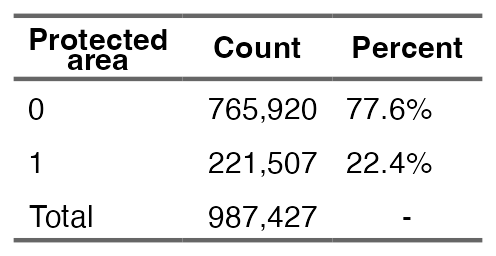")
# temp.mat <- as.matrix(temp.df)
# colnames(temp.mat) <- NULL
# knitr::kable(temp.mat, caption="Protected area normalized score counts and percentage across the Greater North Sea")


```

Table 9: Habitat classification for species designated under EU Habitats and Birds Directives within the Doggerbank and Sydlige Nordsø protected areas8

| Protected area | Species | Unlikely | Probable | Core |
|----------------|---------|----------|----------|------|
| Doggerbank | _Fulmarus glacialis_ | 0% | 100% | 0% |
| Doggerbank | _Larus fuscus_ | 0% | 100% | 0% |
| Doggerbank | _Morus bassabus_ | 0% | 0% | 100% |
| Doggerbank | _Rissa tridactyla_ | 0% | 0% | 100% |
| Doggerbank | _Uria aalge_ | 0% | 100% | 0% |
| Doggerbank | _Phoca vitulina_ | 35% | 65% | 0% |
| Doggerbank | _Phocoena phocoena_ | 0% | 0% | 100% |
| Sydlige Nordsø | _Halichoerus grypus_ | 0% | 0% | 100% |
| Sydlige Nordsø | _Phoca vitulina_ | 29% | 71% | 0% |
| Sydlige Nordsø | _Phocoena phocoena_ | 0% | 0% | 100% |
| Sydlige Nordsø | _Gavia arctica_ | 38% | 40% | 22% |
| Sydlige Nordsø | _Gavia stellata_ | 1.26% | 46.54% | 52.20% |
| Sydlige Nordsø | _Hydrocoloeus minutus_ | 0% | 55.35% | 44.65% |
| Sydlige Nordsø | _Melanitta nigra_ | 5.66% | 43.71% | 50.63% |

## **Considerations / Limitations / Assumptions**
### Data components
A major limitation of the study was the inability to integrate more datasets for the nature index. The analysis desired to include more datasets and alternatives to the ones that got ingested, but had barriers for inclusion. A major limitation regarded data licensing and permissions. For instance, while the UNEP-WCMC seagrass is an imperfect dataset given that it was created as a global dataset, and cannot accurately represent localized, high resolution areas, it was the best alternative available. A [seagrass layer](https://emodnet.ec.europa.eu/geonetwork/srv/eng/catalog.search#/metadata/39746d9c-4220-425c-bc26-7cb3056c36a5) exists that has 250m resolution for the North Sea ([report](https://emodnet.ec.europa.eu/sites/emodnet.ec.europa.eu/files/public/c20190514_generating_eovs.pdf)). The data were only for non-commercial use.

The [Danmarks Miljøportal](https://miljoeportal.dk/en) (Danish Environmental Portal) and the [Arealdata](https://arealdata.miljoeportal.dk) host sixteen environmental data related to the [coast and ocean](https://arealdata.miljoeportal.dk/?tags=marin&tags=marine_naturtyper-kortlægning) for Denmark. Datasets on the portals did not get integrated due to access issues, licensing, or geographic scope. Changes to the data and the portal in the future may remove or lower these limitations.

Two other datasets that would contribute to understanding bird species in the North Sea were limited by the inability to use them for commercial uses. [BirdLife](https://datazone.birdlife.org/search) and [SeaTrack](https://experience.arcgis.com/experience/c6704d258685414cb020e1de136f6695) contain species data with North Sea coverage. Along with these seabird data, if the analysis could expand build its own species distribution models, ICES's [European Seas at Sea](https://www.ices.dk/data/data-portals/Pages/European-Seabirds-at-sea.aspx) and its [Joint Cetacean Data Programme](https://www.ices.dk/data/data-portals/Pages/Cetaceans.aspx) data would provide years of presence data. Without building a separate species distribution models, an faster step to create a more comprehensive model is to include more species already modeled by the MPA Europe project. As of August 2025, the project produced species distribution models for 12,039 species (explore [main results](https://iobis.github.io/mpaeu_docs/results.html)). If an alternative were found, the most appealing data product would be a species distribution model that integrated absence data. Presence-only models, while easier to generate, have more accurate outputs.

Finding alternative data to those included in the analysis could help address a major limitation with the analysis -- the spatial resolution for the fish, cetacean, and seabird data layers. Downscaling the fish dataset from 0.25° and the cetacean and seabird datasets from 5km generates numerous issues that generate inherent issues with evaluating the nature score with significant confidence. To
improve the model outputs, datasets should have more aligned resolutions and ones that are closer to the desired output (in the case of this study, 500m). Additionally it is more preferable to not have a summarized data product for species richness that had to get used for the fish data layer. In a more ideal scenario, the species richness would get create in a more similar process to how this analysis generated the summarized data product for cetaceans and seabirds.

### Analysis components
An assumption was made that the maximum score would get kept to reflect a higher nature score. Another major assumption was the inclusion of species even if it only had a single observation in the study region. Although the inclusion does allow for a more precautionary approach for representing nature, it may not allow for the most accurate reflection. This complicated how the species distribution models got scored, as potential distribution needed to get differentiated from "real" distribution. Species distribution model outputs of 1 should not get evaluated the same as one with 99. With more time, the analysis could undertake more nuance to define unlikely habitat, probable habitat, and core habitat.

### Future
Explore how species interact with areas that are defined for protected areas in the North Sea -- though should be aware of how the areas might get designation for a particular species due to nesting or another part of the life cycle that limits the time spent in that specific geography.

